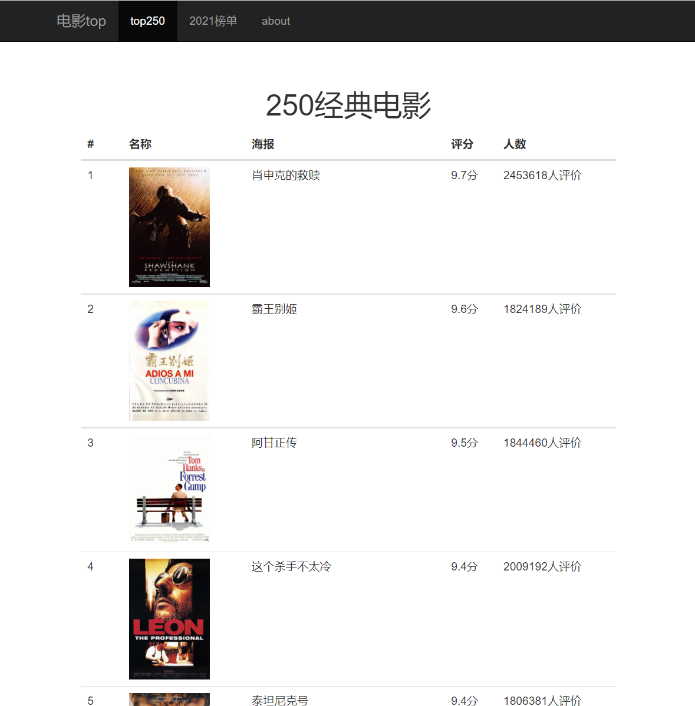

# movie-website

爬取豆瓣 top 电影, 建立自己的电影网，该项目仅供学习使用。

## 用到的工具：

* [request-html](https://github.com/psf/requests-html)
* [flask](https://github.com/pallets/flask)
* [sqlite](https://www.sqlite.org/index.html)
* [bootstrap](https://v3.bootcss.com/)


## 运行

* Windows

```shell
> $env:FLASK_APP = "server"
> flask run
 * Running on http://127.0.0.1:5000/
```

## 页面

http://127.0.0.1:5000/movie


